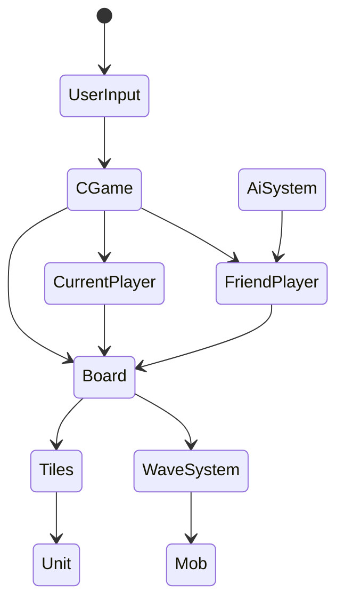

# 과제

운빨존많겜 클로닝

## 필수 구현

-  보통 난이도 모드(오프라인)
- 유닛 소환, 도박, 합성, 신화 유닛 조합, 판매
- 몬스터 : 일반, 보스
- AI로직

## 스크립트 구조

## 데이터 테이블

- LocalizeTable (번역 테이블)

https://docs.google.com/spreadsheets/d/1eCrTKyBVvhmIOEobvx-JJ4knSWnZrUlZd4906QhN-JY/edit?gid=0#gid=0

- MobTable (Mob의 능력치 테이블)

https://docs.google.com/spreadsheets/d/1eCrTKyBVvhmIOEobvx-JJ4knSWnZrUlZd4906QhN-JY/edit?gid=1487615054#gid=1487615054

-  NomalWaveTable(노멀의 웨이브 테이블)

https://docs.google.com/spreadsheets/d/1eCrTKyBVvhmIOEobvx-JJ4knSWnZrUlZd4906QhN-JY/edit?gid=810354765#gid=810354765

- UnitTable(유닛의 능력치 테이블)

https://docs.google.com/spreadsheets/d/1eCrTKyBVvhmIOEobvx-JJ4knSWnZrUlZd4906QhN-JY/edit?gid=41146366#gid=41146366

- SkillTable(유닛의 스킬 능력치 테이블)

https://docs.google.com/spreadsheets/d/1eCrTKyBVvhmIOEobvx-JJ4knSWnZrUlZd4906QhN-JY/edit?gid=2051212627#gid=2051212627

- SummonTable(소환 확률관리 테이블)

https://docs.google.com/spreadsheets/d/1eCrTKyBVvhmIOEobvx-JJ4knSWnZrUlZd4906QhN-JY/edit?gid=19398051#gid=19398051

- MythTable(신화유닛 조합 관리 테이블)

https://docs.google.com/spreadsheets/d/1eCrTKyBVvhmIOEobvx-JJ4knSWnZrUlZd4906QhN-JY/edit?gid=1578270789#gid=1578270789

-  UpgradeTable (강화 테이블)

https://docs.google.com/spreadsheets/d/1eCrTKyBVvhmIOEobvx-JJ4knSWnZrUlZd4906QhN-JY/edit?gid=107283654#gid=107283654

- GachaTable ( 도박 확률 관리 테이블)

https://docs.google.com/spreadsheets/d/1eCrTKyBVvhmIOEobvx-JJ4knSWnZrUlZd4906QhN-JY/edit?gid=1169435393#gid=1169435393

## 제작 과정 내용 정리

https://github.com/shogun0331/TaskProject/milestone/1?closed=1

## 과제 영상 유튜브 URL

https://www.youtube.com/shorts/kHHMcMy_HyM